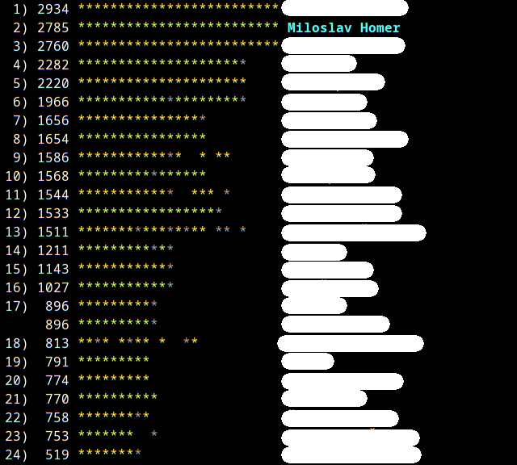

Python3 tool for Advent of Code
===============================

 - prepare the files with solution and tests - jinja templates!
 - date sanity checks, defaults to today
 - automatically fetch the input given the AoC year and day (you'd need the token, see [here](https://github.com/wimglenn/advent-of-code-wim/issues/1)).
 - custom lib for common obstacles
 - leaderboard inspection
 - autosubmit found answers
 - built-in profiler
 - login helper

Install
-------

    git clone https://github.com/ArcHound/advent_of_code
    cd advent_of_code
    python3 -m venv venv
    source venv/bin/activate
    pip3 install -r requirements.txt
    ./advent_of_code.py --help

CLI
---

### Commands

    Usage: advent_of_code.py [OPTIONS] COMMAND [ARGS]...
    
    Options:
      --help  Show this message and exit.
    
    Commands:
      leaderboard  Show leaderboard (global or private (also lists those))
      login        *Start here* - Login the tool into the Advent of Code
      prepare      Prepare the template and the test for a given day
      solve        Solve for the input of a given day
    
### Login command

You should start by issuing the login command, so that the tool has access to your Advent of Code profile. 
Decided to keep it simple and you're a programmer anyway, pry open that token from the browser!

    $ ./advent_of_code login
    Welcome! Let's login into the Advent of Code, shall we.
    We'll open the browser at https://adventofcode.com so you can login.
    Once there, please go to dev tools (F12), network or storage, and grab the session cookie.
     
    Press any key to continue...
    Please paste the cookie value here: 51607c7465645f5fe5267bd234026283afa560a0534ac8485a3e6d0c9d374c21166675f836667e3ef47d2e5237e41337dac74ba7c4b313edd53ffb7b7d273546
     
    If your username is Miloslav Homer, then you've succesfully logged in.
    The token is stored in the .env file, .gitignore should cover you.
    The expiration time is about 10 years, so don't worry about it.
     
    Good luck, have fun!
 
Rest of the commands will use this stored token.

### Prepare command

Calling 

    $ ./advent_of_code.py prepare -y2016 -d2

Prepares two files:  

 - source file for the solution (by default) at: `./aoc/year{year}/day{day}.py`
 - test file for the day (by default) at: `./tests/year{year}/test_year{year}_day{day}.py`

To modify the templates, take a look at the `templates` directory and respective files, the tool uses jinja2 as the engine.

### Solve command

Ok, so you have a solution! 
If you made it on the same day, just call the solve command without any parameters, the defaults are provided. 
Otherwise, please specify the year and day which you are solving.
There's a prompt for submitting, there's an `-s` flag for autosubmit.
The tool will identify the unsolved part based on the stars you have for that day.
As an example:

    $ ./advent_of_code.py solve -y2019 -d18
    0
    Send the answer 0 for 2019, day 18, part 1? [y/N]: y
    That's not the right answer.  If you're stuck, make sure you're using the full input data; there are also some general tips on the about page, or you can ask for hints on the subreddit.  Because you have guessed incorrectly 5 times on this puzzle, please wait 5 minutes before trying again. (You guessed 0.) [Return to Day 18]
    $
    
You can still replay the solution for a solved day as well, this time without submitting:

    $ ./advent_of_code.py solve -y2019 -d17
    8928
    880360
    $

Adjust the log level by using the `--log-level` option,
if you'd like to debug the network, you can provide a proxy using the `--proxy` and `--proxy-address` options.
See the defaults for the format by using `--help`.

### Leaderboard command

Finally, you can review the leaderboards using the leaderboard command.

 - You'd need to provide a year by using the `-y` option.
 - You can also list private leaderboards by using the `-l` option,
 - or if you know the ID of the leaderboard you can directly provide it using the `-i` option.

Otherwise, it'll show the global leaderboard by default.
It'll highlight your username as well!

    $ ./advent_of_code leaderboard -y2023 -i 9999999

AoC Library
-----------

Work in progress.

Useful set of tools for repeated situations.
I know that there are better tools for most of these jobs.
But the point of the advent of code is to code, so in most cases (graph algorithms being the most notable exception) I've decided to roll my own.

 - `map2d`: class for working with grid-based 2d maps,
 - `vector2d, vector3d`: common math operations for 2d and 3d vectors,
 - `combinatorics`: selected algorithms,
 - `num_theory`: EGCD, Chinese Remainder Theorem, Eratosthenes Sieve and couple others,
 - `interval`: whole number open-ended intervals,
 - `pixels`: draw image from set of pixels,
 - `intcode2019`: The intcode computer from year 2019 (this was so fun).

An incomplete test suite can be found at `./tests/aoc_lib/`. 
